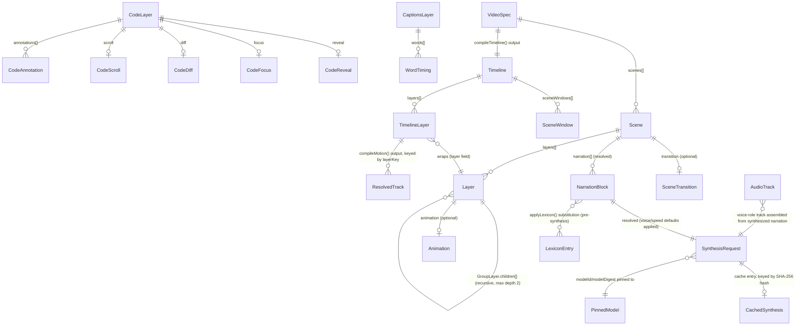

# Domain Model: claudevid

**Path analyzed:** . (repository root)
**Date analyzed:** 2026-09-09

## Entities

> claudevid is a from-scratch pnpm-workspace TypeScript library, not a legacy GUI application — there
> are no `.dfm`/`.xaml`/database-table entities to recover. Every entity below is a Zod-validated (or,
> for compiler output, a plain TypeScript interface) shape read directly from `packages/*/src`. Field
> lists were confirmed by opening each file listed in its Evidence line, not inferred from the
> collector's (empty, for this stack) `type_declarations[]`.

1. **VideoSpec** — the root JSON document a spec author (human or Claude) writes and the whole render
   pipeline consumes. Fields: `version` (literal `1`), `width`/`height`/`fps` (numbers, default
   1920×1080×30), `background` (optional color string), `meta` (`title`/`description`), `audio`
   (`track`/`volume`), `scenes` (`Scene[]`, min 1).
   Evidence: `packages/core/src/types.ts:42-51`, `packages/core/src/schema.ts:97-120`.
   Inference: the entire authored/rendered video project — the one JSON contract the whole system is
   built around (`docs/Qwen_markdown_...md`'s own "Claude generates a validated VideoSpec JSON" pipeline diagram).

2. **Scene** — one timeline segment. Fields: `id` (unique string, DR-001), `duration`
   (`number` seconds | literal `"auto"`), `background` (optional, falls back to the spec-level one),
   `layers` (recursive `Layer[]`), `transition` (`SceneTransition`, optional), `narration`
   (`NarrationBlock[]`, normalized at parse time from a bare string / single object / array).
   Evidence: `packages/core/src/types.ts:27-40`, `packages/core/src/schema.ts:68-86`.
   Inference: the structural unit "auto" duration and cross-fade transitions apply to.

3. **SceneTransition** — `kind` (`"cut"|"cross-fade"`), `duration` (seconds).
   Evidence: `packages/core/src/types.ts:16-19`, `packages/core/src/schema.ts:22-25`.
   Inference: how one scene visually replaces the previous one; only `"cross-fade"` carries a real
   overlap duration, clamped by `compileTimeline` (DR-005).

4. **NarrationBlock** — `text`, `voice` (optional), `speed` (optional).
   Evidence: `packages/core/src/types.ts:21-25`, `packages/core/src/schema.ts:27-31`.
   Field-semantics note: at the schema boundary a scene's `narration` accepts a bare string, one
   `NarrationBlock`-shaped object, or an array of them, then is normalized and **auto-chunked** into
   `NarrationBlock[]` under the ≤90-word rule (DR-003) — the authored shape and the resolved in-memory
   shape genuinely diverge, which is why `schema.ts` declares a distinct `SceneInput` type for it
   (`packages/core/src/schema.ts:60-66`).
   Inference: the script Kokoro TTS reads aloud for that scene; the sole driver of "auto"
   scene-duration computation (MOD-006).

5. **Layer** (discriminated union on `type`) — one visual/audio element positioned inside a scene. Six
   concrete members are registered into a single runtime union via `registerLayer`: `TextLayer`,
   `RectLayer`, `ImageLayer`, `GroupLayer` (all `packages/core`), `CodeLayer` (`packages/layer-code`),
   `CaptionsLayer` (`packages/layer-captions`). All share a base shape: `x`/`y` (`Coordinate` =
   `number | "center" | "<number>%"`), `start`/`duration` (seconds, layer-local), `animation`
   (`Animation`, optional).
   Evidence: `packages/core/src/layers.ts:40-46,95,118-132`.
   Inference: the atomic renderable unit; `flattenLayers` (`packages/core/src/timeline.ts:65-107`)
   recursively walks this tree (including group children) into the flat compiled `TimelineLayer[]`.

6. **TextLayer** — `text` (1-300 chars, DR-008), `fontSize`, `fontWeight` (100-900, DR-009), `color`,
   `fontFamily`, `maxWidth`, `lineHeight`, `align` (`"left"|"center"|"right"`).
   Evidence: `packages/core/src/layers.ts:48-60`.

7. **RectLayer** — `width`/`height` (required, positive), `fill`, `stroke`, `strokeWidth`, `radius`.
   Evidence: `packages/core/src/layers.ts:62-72`.

8. **ImageLayer** — `src` (required, non-empty string), `width`/`height` (optional — falls back to the
   decoded image's natural size), `fit` (`"cover"|"contain"|"fill"`).
   Evidence: `packages/core/src/layers.ts:74-82`.
   **Field-semantics note (Field Semantics & Capture-Widget Rule):** `src` is typed as a plain string
   but its actual content is a **filesystem path or URL**, consumed by `@napi-rs/canvas`'s `loadImage`
   (`packages/renderer-canvas/src/draw-image.ts:7,67`) — never raw image bytes, and the Zod schema
   itself only checks `z.string().min(1)` (`packages/core/src/layers.ts:77`), no path/URL shape
   validation. The write path is entirely author-supplied: there is no upload/capture mechanism
   anywhere in this codebase — a human or Claude simply writes a path/URL string into the JSON. Claude's
   own director prompt explicitly instructs the model to reference a configured `brand.logoPath`
   verbatim rather than fabricate a path (`packages/claude/src/prompts/build-director-prompt.ts:46-49`).
   The string is resolved once to a decoded, cached `Image` object at render time
   (`packages/renderer-canvas/src/draw-image.ts:5-13`) and never re-serialized.

9. **GroupLayer** — `id`, `children: Layer[]` (recursive), plus the shared base shape; the group's own
   `x`/`y` is inert (never painted itself) — only its `animation` matters, cloned per child with a
   stagger delay offset.
   Evidence: `packages/core/src/layers.ts:84-93,101-106`; `packages/motion/src/compile.ts:129-144`.

10. **CodeLayer** (`packages/layer-code`) — `code` (1-20000 chars, DR-016), `lang`, `theme` (optional,
    default `"github-dark"`), `width`/`height` (required), `title`, `showLineNumbers`, `fontSize`
    (min 12), `tabSize`, `wrap` (`"none"|"soft"`), `maxLines`, `reveal` (`CodeReveal`), `focus`
    (`CodeFocus`), `diff` (`CodeDiff`), `scroll` (`CodeScroll`), `annotations` (`CodeAnnotation[]`).
    Evidence: `packages/layer-code/src/schema.ts:110-130`.
    Inference: an in-video code-walkthrough window with its own legibility guardrails (auto-fit,
    overflow diagnostics), distinct from a plain text layer.

11. **CodeReveal** — discriminated union: `{mode:"typewriter", unit, rate, startDelay, caret}` |
    `{mode:"line-stagger", each, from}`. Evidence: `packages/layer-code/src/schema.ts:50-64`.

12. **CodeFocus** — `lines: [start,end]` (1-indexed), `dimOpacity`, `animate` (`from`/`duration`/
    `delay`/`easing`). Evidence: `packages/layer-code/src/schema.ts:66-78`.

13. **CodeDiff** — `before` (string), `addedBg`, `removedBg`, `revealDelay`, `duration`.
    Evidence: `packages/layer-code/src/schema.ts:80-87`.

14. **CodeScroll** — `toLine`, `fromLine`, `duration`, `delay`, `easing`.
    Evidence: `packages/layer-code/src/schema.ts:89-96`.

15. **CodeAnnotation** — `line`, `text`, `side` (`"left"|"right"`), `color`, `delay`.
    Evidence: `packages/layer-code/src/schema.ts:98-105`.

16. **CaptionsLayer** (`packages/layer-captions`) — `words: WordTiming[]` (min 1).
    Evidence: `packages/layer-captions/src/schema.ts:58-63`.
    Inference: forced-aligned, karaoke-style captions — the **only** layer type the render pipeline
    itself constructs; it is never authored directly in a VideoSpec a human or Claude writes.
    `packages/cli/src/render-pipeline.ts:168` is the sole construction site, and Claude's own director
    prompt is explicitly told never to emit one (DR-049).

17. **WordTiming** (`packages/audio`) — `word`, `start`, `end` (timeline-absolute seconds by the time
    it reaches a captions layer), `estimated` (bool), `confidence` (optional).
    Evidence: `packages/audio/src/word-timing-types.ts:7-14`, `packages/layer-captions/src/schema.ts:47-53`.

18. **Timeline** (compiled, `packages/core`) — `frameCount`, `sceneWindows: SceneWindow[]`,
    `layers: TimelineLayer[]`, `activeAt(frame)`, `transitionAt(frame)`.
    Evidence: `packages/core/src/timeline.ts:39-47`.
    Inference: the single frame-indexed timing authority for the whole render — "nothing downstream
    re-derives a boundary from a `duration` field" (`packages/core/src/timeline.ts:136-137`).

19. **SceneWindow** — `sceneId`, `startFrame`, `endFrame`, `transitionInFrames`.
    Evidence: `packages/core/src/timeline.ts:11-18`.

20. **TimelineLayer** — `layerKey` (path-shaped id, e.g. `"scenes/0/layers/1"`), `sceneId`, `type`,
    `startFrame`, `endFrame`, `x`/`y` (pixel-resolved), `background`, `layer` (the original authored
    `Layer`). Evidence: `packages/core/src/timeline.ts:27-37`.

21. **Track / ResolvedTrack** (`packages/motion`) — `Track`: `property` (`Channel`), `from`, `to`,
    `duration` (seconds), `delay`, `easing`. `ResolvedTrack`: same, baked to frames
    (`delayFrames`/`durationFrames`), plus either an `easingFn` or `bakedFrames[]` (spring easing).
    Evidence: `packages/motion/src/track.ts:13-41`.
    Inference: the compiled per-property animation segment a preset expands into — only six "free"
    channels ship (`opacity|x|y|scaleX|scaleY|rotation`, `packages/motion/src/properties.ts:7-24`),
    chosen because none invalidate the raster cache.

22. **SynthesisRequest** (`packages/audio`) — `text`, `voice`, `speed`, `modelId`, `modelDigest`,
    `lexiconDigest`. Evidence: `packages/audio/src/types.ts:10-21`.
    Field-semantics note: every field is always fully resolved before hashing — deliberately, since
    this object's canonical JSON serialization *is* the TTS cache key (DR-023).

23. **CachedSynthesis** — `audio` (`Buffer`, raw 16-bit PCM), `durationSeconds`.
    Evidence: `packages/audio/src/types.ts:26-29`.
    Field-semantics note: on disk this is base64-encoded inside one JSON file per hash
    (`<hash>.json`) rather than stored as a binary file — a deliberate readability/atomicity
    tradeoff (`packages/audio/src/cache.ts:1-19`).

24. **PinnedModel** — `id`, `url`, `fileName`, `digest` (SHA-256).
    Evidence: `packages/audio/src/models.ts:30-54`.
    Inference: the one committed, integrity-verified TTS model descriptor. **`PINNED_MODEL.digest` in
    the current codebase is a syntactically-valid placeholder, not a real digest** — see Named Gaps.

25. **LexiconEntry** — `term`, `replacement`. Evidence: `packages/audio/src/lexicon.ts:18-21`.
    Inference: a project pronunciation-respelling override, applied to narration text before
    synthesis (literal text substitution, not phonetic).

26. **AudioTrack** (audio-graph, `packages/audio/src/graph.ts`) — `filePath`, `gainDb`,
    `fadeInSeconds`, `fadeOutSeconds`, `loop`, `duck`, `role` (`"voice"|"music"|"sfx"`).
    Evidence: `packages/audio/src/graph.ts:22-38`.
    Inference: supports multi-track mixing (music/SFX ducking under voice) even though the shipped
    render pipeline currently only ever constructs a single `role: "voice"` track — see Named Gaps.

27. **Diagnostic** (`packages/core`) — `path` (JSON pointer), `message`, `suggestion` (optional).
    Evidence: `packages/core/src/diagnostics.ts:5-9`.
    Inference: the uniform "what's wrong and how to fix it" unit threaded through schema validation,
    motion compilation, and code-layer compilation alike — built for Claude's repair loop to consume
    directly (`packages/core/src/diagnostics.ts:33`).

28. **BrandKitConfig** (`packages/claude`) / **CliConfig** (`packages/cli`, a structurally-duplicated,
    non-Zod mirror) — `model`, `repairAttempts`, `voice`, `brand{palette[], fontFamily, logoPath}`.
    Evidence: `packages/claude/src/config-schema.ts:3-13`, `packages/cli/src/config.ts:7-16`.
    Inference: per-project generation defaults/style guardrails read from `claudevid.config.json`.

29. **ChapterOutline** — `title`, `summary`. Evidence: `packages/claude/src/types.ts:10`,
    `packages/claude/src/chapters.ts:6-22,41-71`.
    Inference: a single chapter's plan, produced by one Claude call before per-chapter VideoSpec
    generation (multi-chapter long-form videos).

30. **BatchJobResult** — `file`, `status` (`"ok"|"failed"`), `error`, `outputPath`.
    Evidence: `packages/cli/src/commands/batch.ts:46-51`.

31. **EncoderCapabilities / ResolvedProfile / ProgressEvent** (`packages/encoder-ffmpeg`) —
    capability-probe result, resolved codec+bitrate, and a parsed FFmpeg progress line, respectively.
    Evidence: `packages/encoder-ffmpeg/src/types.ts:8-39`.

## Relationships

**Narrative.** claudevid has no database and no foreign-key layer — every relationship above is a
compositional (has-a) association inferred from an array/optional-object field in a schema file I
opened this run, not an enforced cardinality. Two relationships are worth calling out explicitly:

- `TimelineLayer ||--o{ ResolvedTrack` and `NarrationBlock ||--|| SynthesisRequest` are **derived**
  relationships, not authored ones — they only exist after `compileMotion`/the render pipeline's own
  `resolveSynthesisRequest` runs; nothing in a raw `VideoSpec` JSON file states them directly.
- The `Layer ||--o{ Layer` self-relationship (`GroupLayer.children`) is capped at
  `MAX_GROUP_NESTING_DEPTH = 2` (`packages/core/src/layers.ts:134`, DR-002) — a real, enforced
  constraint on an otherwise-recursive structure, not an unbounded tree.
- `AudioTrack }o--|| SynthesisRequest` reflects `render-pipeline.ts`'s own `assembleVoiceTrack`
  (`packages/cli/src/render-pipeline.ts:200-257`) — in the shipped CLI path exactly one `AudioTrack`
  (role `"voice"`) is ever built from all of a spec's synthesized narration; the audio-graph's
  `"music"`/`"sfx"` roles have no authoring path from a `VideoSpec` at all (Named Gap, functional-spec.md).

## Business Rules

<!--
  DR-NNN IDs below are assigned in first-discovery order across packages/core, packages/motion,
  packages/layer-code, packages/layer-captions, packages/audio, packages/encoder-ffmpeg,
  packages/cli, packages/claude — grouped by owning module in module-map.md, but numbered in
  discovery order per the template's own convention. No prior domain-model.md exists at this
  output path (module_map.present: false, this is a first-ever generation) — every DR below is
  newly assigned, none carried forward.
-->

### `@claudevid/core` (MOD-001)

1. **DR-001 — Scene ids must be unique within a spec.** `videoSpecSchema`'s `superRefine` walks
   `spec.scenes` and raises a diagnostic at `/scenes/<i>/id` for any repeated `scene.id`.
   Evidence: `packages/core/src/schema.ts:108-119`.
2. **DR-002 — Layer group nesting is capped at 2 levels.** `checkNestingDepth` walks a scene's layer
   tree and raises a diagnostic the moment a `group` layer's own nesting depth exceeds
   `MAX_GROUP_NESTING_DEPTH = 2`. Evidence: `packages/core/src/layers.ts:134,140-158`,
   `packages/core/src/schema.ts:77-86`.
3. **DR-003 — Narration text is auto-chunked to ≤90 words per synthesized block.** A deliberately
   conservative ceiling (`MAX_SAFE_NARRATION_WORDS = 90`) kept well below Kokoro's documented
   509-*phoneme*-token cap, because the phonemes-per-word ratio varies with punctuation/numbers/
   abbreviations — the reason is stated in-source, not left to inference.
   Evidence: `packages/core/src/narration-chunking.ts:1-15`.
4. **DR-004 — A `duration: "auto"` scene requires a matching `audioDurations` entry.**
   `compileTimeline` throws `MissingAudioDurationError` (naming the scene id) if one is absent.
   Evidence: `packages/core/src/timeline.ts:4-9,58-63`.
5. **DR-005 — A cross-fade's requested overlap is silently clamped, never rejected.** The overlap is
   clamped so it never exceeds either neighbouring scene's own frame count minus one; the clamp
   itself is silent in `compileTimeline` (mirroring the file's own rendering-overflow clamp
   precedent) — the diagnostic for a clamp having actually fired is emitted one layer up, by
   `@claudevid/motion`'s `compileMotion` (DR-013's sibling), which has both the requested duration
   and the resulting window to compare. Evidence: `packages/core/src/timeline.ts:148-164`;
   `packages/motion/src/compile.ts:161-178`.
6. **DR-006 — A layer's `start`/`duration` overflowing its scene window is clamped, not diagnosed.**
   Documented explicitly as "a documented v1 limitation." Evidence: `packages/core/src/timeline.ts:84-86`.
7. **DR-007 — Coordinate resolution: `"center"` = half the dimension; a `"N%"` string resolves as a
   percentage of the dimension; a plain number passes through unchanged.**
   Evidence: `packages/core/src/resolve.ts:4-10`.
8. **DR-008 — A text layer's `text` is capped at 300 characters (minimum 1).**
   Evidence: `packages/core/src/layers.ts:51`.
9. **DR-009 — A text layer's `fontWeight` must be in `[100, 900]`.**
   Evidence: `packages/core/src/layers.ts:53`.

### `@claudevid/motion` (MOD-002)

10. **DR-010 — An unknown animation preset name is a diagnostic, never a silent no-op.**
    `resolvePresetTracks` pushes a diagnostic naming the unknown preset and skips that layer's
    animation entirely. Evidence: `packages/motion/src/compile.ts:25-45`.
11. **DR-011 — `animation.exit` is schema-legal but unsupported in v1** — always diagnosed
    ("deferred to a follow-up change"), regardless of layer type.
    Evidence: `packages/motion/src/compile.ts:121-127`.
12. **DR-012 — `stagger` is only meaningful on a group layer's own `animation`.** Setting it on a
    non-group layer's animation raises a diagnostic suggesting it be moved or removed.
    Evidence: `packages/motion/src/compile.ts:147-153`.
13. **DR-013 — An animation exceeding its layer's active interval is diagnosed, naming both frame
    counts**, and (per DR-005) is also where a cross-fade clamp's diagnostic fires.
    Evidence: `packages/motion/src/compile.ts:87-93,161-178`.
14. **DR-014 — A spring easing must "settle" within a 5-second bake cap** (`BAKE_CAP_SECONDS = 5`),
    else `bakeSpring` returns `settled: false` and `compileMotion` throws `UnsettledSpringError`
    (surfaced as a diagnostic). Spring parameters are themselves range-checked before baking:
    `stiffness ∈ (0,1000]`, `damping ∈ (0,100]`, `mass ∈ (0.01,100]`.
    Evidence: `packages/motion/src/easing.ts:86-131`, `packages/motion/src/compile.ts:47-63`.
15. **DR-015 — A preset must never declare two tracks for the same animation channel** — a dev-time
    (build-time, never spec-authored) invariant enforced by `definePreset` itself throwing.
    Evidence: `packages/motion/src/presets.ts:9-22`.

### `@claudevid/layer-code` (MOD-004)

16. **DR-016 — A code block's `code` text is capped at 20000 characters (minimum 1).**
    Evidence: `packages/layer-code/src/schema.ts:113`.
17. **DR-017 — Auto-fit retries font size down to a 12px floor (`AUTO_FIT_FLOOR_PX`); if the longest
    line still doesn't fit at the floor, a "line too long" diagnostic fires naming the character
    count and the floored font size, and the layer is blocked from painting.**
    Evidence: `packages/layer-code/src/layout.ts:51,251-266`; `packages/layer-code/src/diagnostics.ts:49-61,90-93`.
18. **DR-018 — Effective line count (after wrap) exceeding `min(maxLines, availableLines)` without a
    `scroll` config is a line-overflow diagnostic and blocks the layer** — a `scroll` config exempts
    only this check, never the width-fit check (DR-017). Evidence: `packages/layer-code/src/diagnostics.ts:37-47,95-101`.
19. **DR-019 — `focus.lines` / `scroll.toLine` / `scroll.fromLine` / any `annotations[].line` outside
    `[1, codeLineCount]` is a diagnostic, never silently clamped.**
    Evidence: `packages/layer-code/src/diagnostics.ts:103-168`.
20. **DR-020 — An unsupported `lang` or `theme` (not in the 8 bundled languages / 3 bundled themes)
    is a diagnostic naming every valid option; the layer is skipped from compilation/render, never
    thrown.** Evidence: `packages/layer-code/src/highlight.ts:174-182`, `packages/layer-code/src/diagnostics.ts:19-33`.
21. **DR-021 — `CodeOverflowError` is thrown at render time (fail-closed) for any compiled entry
    whose layout was `blocked`** (the render-time half of DR-017/018/019's compile-time guardrails).
    Evidence: `packages/layer-code/src/render.ts:107-110,544,560`.

### `@claudevid/layer-captions` (MOD-005)

22. **DR-022 — A caption word is "active" over a half-open `[start, end)` window** — its own `end`
    boundary belongs to whichever word (if any) starts there next; never double-counted.
    Evidence: `packages/layer-captions/src/render.ts:68-82`.

### `@claudevid/audio` (MOD-006)

23. **DR-023 — The TTS cache key is the SHA-256 hex digest of the full, canonically-ordered
    `SynthesisRequest` object (all 5 fields), never a hand-picked subset** — so any single field
    change (including a lexicon digest change) changes the cache key automatically.
    Evidence: `packages/audio/src/cache.ts:1-19,52-60`.
24. **DR-024 — A model-file digest mismatch on load fails closed, never silently re-fetches.**
    `verifyInstalledModel` throws `ModelDigestMismatchError` naming both digests.
    Evidence: `packages/audio/src/models.ts:56-73,148-168`.
25. **DR-025 — Network access is confined to the explicit `installModels()` call** — every other
    function in this module touches only the local filesystem.
    Evidence: `packages/audio/src/models.ts:14-16`.
26. **DR-026 — A `duration: "auto"` scene with missing or empty narration throws `EmptyNarrationError`
    naming the scene** (in `computeAudioDurations` — see the Named Gap on whether this is actually
    reachable from the CLI). Evidence: `packages/audio/src/durations.ts:50-63,144-150`.
27. **DR-027 — A scene's computed audio duration exceeding `maxDurationSeconds` (default 600s) throws
    `MaxDurationExceededError`, naming the scene id and measured value — never silently clamped.**
    Evidence: `packages/audio/src/durations.ts:65-82,163-166`.
28. **DR-028 — Falling below `minDurationSeconds` (default 0) is silently raised to the floor, no
    error** — the deliberate asymmetric counterpart to DR-027.
    Evidence: `packages/audio/src/durations.ts:167-169`.
29. **DR-029 — Forced-alignment spans reconciliation can't confidently map fail closed
    (`LowConfidenceSpanError`) unless `allowEstimated: true`, in which case they are filled by
    proportional time-distribution across the surrounding matched gap and marked `estimated: true`.**
    Evidence: `packages/audio/src/align.ts:234-250,323-356`.
30. **DR-030 — Forced-alignment output must be monotonic, non-negative, and bounded by the audio's
    measured duration; a failure throws `AlignmentValidationError` naming the specific check, word
    index, and word.** Evidence: `packages/audio/src/align.ts:252-266,358-389`.
31. **DR-031 — Audio-graph numeric parameters are validated against explicit ranges and rejected (never
    clamped)**: `gainDb ∈ [-60,20]`, fade seconds `∈ [0,30]`, `outputDurationSeconds ∈ (0,86400]`,
    `loudnormTargetLufs ∈ [-70,-5]`. Evidence: `packages/audio/src/graph.ts:62-82,134-161`.
32. **DR-032 — A track's `fadeOutSeconds` must not exceed `outputDurationSeconds`.**
    Evidence: `packages/audio/src/graph.ts:152-159`.
33. **DR-033 — A `duck: true` track requires at least one `role: "voice"` track to duck against, else
    `AudioGraphValidationError`.** Evidence: `packages/audio/src/graph.ts:163-171`.
34. **DR-034 — Muxed output duration must agree with the silent-video input's duration within a
    tolerance (default 50ms); a mismatch throws `MuxDurationMismatchError` naming both durations,
    and cleans up every temp file.** Evidence: `packages/audio/src/mux.ts:101-119,336-361`.
35. **DR-035 — Mux never overwrites an existing `outputPath` unless `force: true`, and never overwrites
    `silentVideoPath` in place — checked before any FFmpeg process spawns.**
    Evidence: `packages/audio/src/mux.ts:54-78,277-289`.
36. **DR-036 — Only lexicon entries that actually matched the given text are counted toward the
    lexicon digest** — an entry for an absent word is a no-op that never affects the TTS cache key.
    Evidence: `packages/audio/src/lexicon.ts:34-72`.

### `@claudevid/encoder-ffmpeg` (MOD-007)

37. **DR-037 — Codec resolution prefers `h264_videotoolbox` unless `cpuEncode` was explicitly
    requested or VideoToolbox is unavailable; an explicit `cpuEncode` request is never silently
    overridden — it throws if `libx264` is also unavailable.**
    Evidence: `packages/encoder-ffmpeg/src/profiles.ts:43-79`.
38. **DR-038 — FFmpeg's argv never emits a resolution-changing filter** (e.g. `-vf scale=...`) —
    output geometry comes solely from the caller's `input.geometry`, stated directly on the raw-RGBA
    input side. Evidence: `packages/encoder-ffmpeg/src/argv.ts:1-47`.
39. **DR-039 — `EncodePipe.write()`/`finish()` throw synchronously if called after the pipe has
    already finished; `cancel()` after finish is a no-op instead of an error.**
    Evidence: `packages/encoder-ffmpeg/src/pipe.ts:218-246`.
40. **DR-040 — `cancel()` SIGTERMs the FFmpeg process, escalating to SIGKILL after a 5-second grace
    period (`CANCEL_GRACE_MS`) if it hasn't exited.**
    Evidence: `packages/encoder-ffmpeg/src/pipe.ts:28-31,202-216`.

### `@claudevid/cli` (MOD-008)

41. **DR-041 — `render` refuses to overwrite an existing `--out` file unless `--force` is passed.**
    Evidence: `packages/cli/src/commands/render.ts:78-80`.
42. **DR-042 — An explicit CLI flag always wins over `claudevid.config.json`'s corresponding field.**
    Evidence: `packages/cli/src/config.ts:63-69`.
43. **DR-043 — An individual batch job's failure never fails the whole batch** — `process.exitCode`
    is always 0 once a batch has run; failures are only recorded in the per-job manifest.
    Evidence: `packages/cli/src/commands/batch.ts:1-7,183-188,225`.
44. **DR-044 — Contact-sheet frame count is bounded to `[1, 24]` (`MAX_SHEET_FRAMES`), default 6.**
    Evidence: `packages/cli/src/commands/preview.ts:25-26,49-56`.
45. **DR-045 — `preview`'s working resolution is capped: `scale = 1280 / spec.width` whenever
    `spec.width > 1280`, otherwise unscaled.** Evidence: `packages/cli/src/commands/preview.ts:29,66-73`.

### `@claudevid/claude` (MOD-009)

46. **DR-046 — The generation repair loop allows up to `repairAttempts` (default 3) total attempts;
    on an invalid spec, the model's own diagnostics are fed back as a repair instruction; exhausting
    every attempt throws `GenerationFailedError` carrying only the last attempt's diagnostics.**
    Evidence: `packages/claude/src/generate.ts:7,20-29,31-66`.
47. **DR-047 — `generate` fails fast (before any API call) if `ANTHROPIC_API_KEY` is unset.**
    Evidence: `packages/cli/src/commands/generate.ts:84-88`.
48. **DR-048 — `mergeChapters` throws `SceneIdCollisionError` naming every colliding scene id, rather
    than returning a partially-merged spec, if any scene id repeats across chapters.**
    Evidence: `packages/claude/src/chapters.ts:73-114`.
49. **DR-049 — Claude's director prompt hard-forbids emitting a `captions`-typed layer** — a
    prompt-level constraint (not a schema/code-enforced one) that the render pipeline itself is the
    sole constructor of that layer type (see Entity 16).
    Evidence: `packages/claude/src/prompts/build-director-prompt.ts:78-80`.

### `@claudevid/layer-code` (contrast audit, MOD-004 — discovered after the initial layer-code pass)

50. **DR-050 — `checkThemeContrast` computes the WCAG 2.1 contrast ratio between every distinct token
    colour and each bundled theme's background** (excluding tokens with their own background
    override) — an auditing primitive, not an enforced compile-time or render-time check (see Named
    Gaps in functional-spec.md: it is exported and tested but never invoked from the compile/render
    path). Evidence: `packages/layer-code/src/themes.ts:1-33,81-136`.

## Enumerations

1. **`SceneTransition.kind`** — `"cut" | "cross-fade"`. Evidence: `packages/core/src/schema.ts:23`.
   Inference: how a scene visually begins relative to its predecessor — a hard cut vs. an overlapping
   dissolve (DR-005/DR-013).
2. **`TextLayer.align`** — `"left" | "center" | "right"`. Evidence: `packages/core/src/layers.ts:58`.
   Inference: text justification within its wrapped bitmap and, separately, the bitmap's own
   horizontal anchor at paint time (`packages/renderer-canvas/src/index.ts:46-50`).
3. **`ImageLayer.fit`** — `"cover" | "contain" | "fill"`. Evidence: `packages/core/src/layers.ts:80`.
   Inference: standard CSS-`object-fit`-equivalent image-to-box scaling behavior.
4. **`Animation.stagger.from`** — `"first" | "center" | "last" | "random"`.
   Evidence: `packages/core/src/layers.ts:16-17`. Inference: which child in a group's stagger cascade
   animates first; `"random"` is a deterministic FNV-1a hash order, never true randomness
   (`packages/motion/src/stagger.ts:7-18`).
5. **`CodeReveal.mode`** — `"typewriter" | "line-stagger"`.
   Evidence: `packages/layer-code/src/schema.ts:50-63`. Inference: two distinct code-reveal
   animation styles — character/token/line-by-line typing vs. whole-lines-cascading-in.
6. **`CodeReveal` (typewriter) `.unit`** — `"char" | "token" | "line"`.
   Evidence: `packages/layer-code/src/schema.ts:53`. Default reveal rates differ per unit: 30/sec
   (char), 8/sec (token), 2/sec (line) — `packages/layer-code/src/animations.ts:49-54`.
7. **`CodeLayer.wrap`** — `"none" | "soft"`. Evidence: `packages/layer-code/src/schema.ts:122`.
   Inference: whether an over-width line triggers the auto-fit retry (DR-017, `"none"`) or wraps with
   a continuation indent instead (`"soft"`, never auto-fits).
8. **`CodeAnnotation.side`** — `"left" | "right"`. Evidence: `packages/layer-code/src/schema.ts:101`.
   Inference: which margin a line-anchored callout is drawn in.
9. **`AudioTrack.role`** (audio-graph) — `"voice" | "music" | "sfx"`.
   Evidence: `packages/audio/src/graph.ts:37`. Inference: which mixing behavior applies (only
   non-voice tracks can `duck`, DR-033).
10. **`ProfileName`** — `"preview" | "final"`. Evidence: `packages/encoder-ffmpeg/src/profiles.ts:11-17`.
    Inference: the two encode-quality tiers — 4000kbps fast-draft vs. 18000kbps delivery-grade.
11. **`ResolvedProfile.codec`** — `"h264_videotoolbox" | "libx264"`.
    Evidence: `packages/encoder-ffmpeg/src/types.ts:17-19`. Inference: hardware-accelerated (Apple
    Silicon VideoToolbox) vs. CPU software encode (DR-037).
12. **`StepDirection`** — `"start" | "end"`. Evidence: `packages/core/src/easing.ts:79`.
    Inference: CSS `steps()`-equivalent easing direction.
13. **`Channel`** (motion) — `"opacity" | "x" | "y" | "scaleX" | "scaleY" | "rotation"`.
    Evidence: `packages/motion/src/properties.ts:7`. Inference: the only animatable properties in v1
    — chosen because each composites via a cheap canvas transform with zero raster-cache invalidation.
14. **`BatchJobResult.status`** — `"ok" | "failed"`. Evidence: `packages/cli/src/commands/batch.ts:48`.
15. **`DiffLine.kind`** — `"unchanged" | "added" | "removed"`. Evidence: `packages/layer-code/src/diff.ts:16`.
    Inference: a changed line is expressed as an adjacent `removed`+`added` pair, never a "changed" kind.
16. **`MuxError.stage`** — `"compose-audio" | "mux"`. Evidence: `packages/audio/src/mux.ts:85`.
17. **`AlignmentValidationError.check`** — `"monotonic" | "non-negative" | "bounded"`.
    Evidence: `packages/audio/src/align.ts:256`.
18. **`Layer.type`** (discriminated union) — `"text" | "rect" | "image" | "group" | "code" | "captions"`.
    Evidence: `packages/core/src/layers.ts:95,108-113`, plus each layer package's own `registerLayer` call.
19. **`BUNDLED_LANGS`** — `typescript, javascript, tsx, jsx, python, bash, json, yaml` (8 values).
    Evidence: `packages/layer-code/src/schema.ts:4-13`. A fixed, closed set an unrecognized `lang`
    is diagnosed against (DR-020), not a Zod enum (design note: a hand-authored diagnostic message
    needs the full list, which a generic enum-violation diagnostic can't produce).
20. **`BUNDLED_THEMES`** — `github-dark, github-light, high-contrast` (3 values).
    Evidence: `packages/layer-code/src/schema.ts:15`. `"high-contrast"` is Shiki's own
    `github-dark-high-contrast` theme, re-registered under this id (`packages/layer-code/src/highlight.ts:25-30`).
