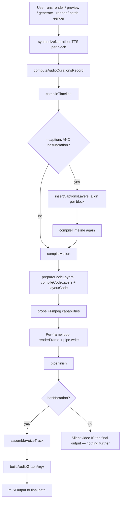
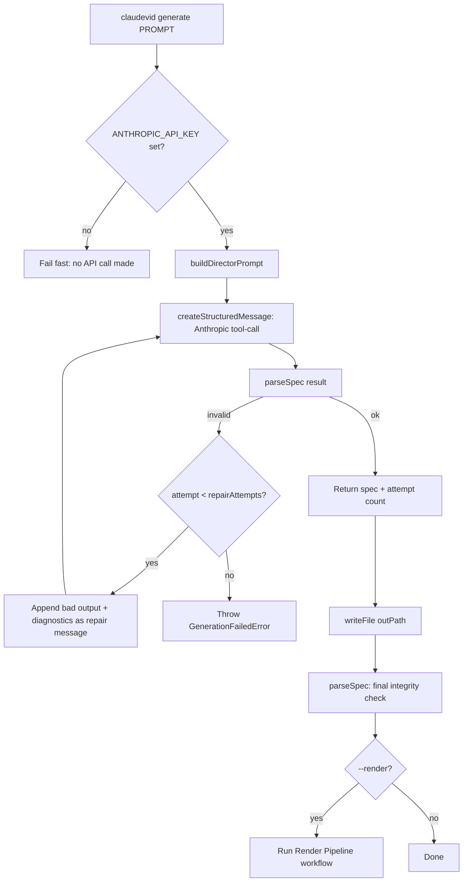
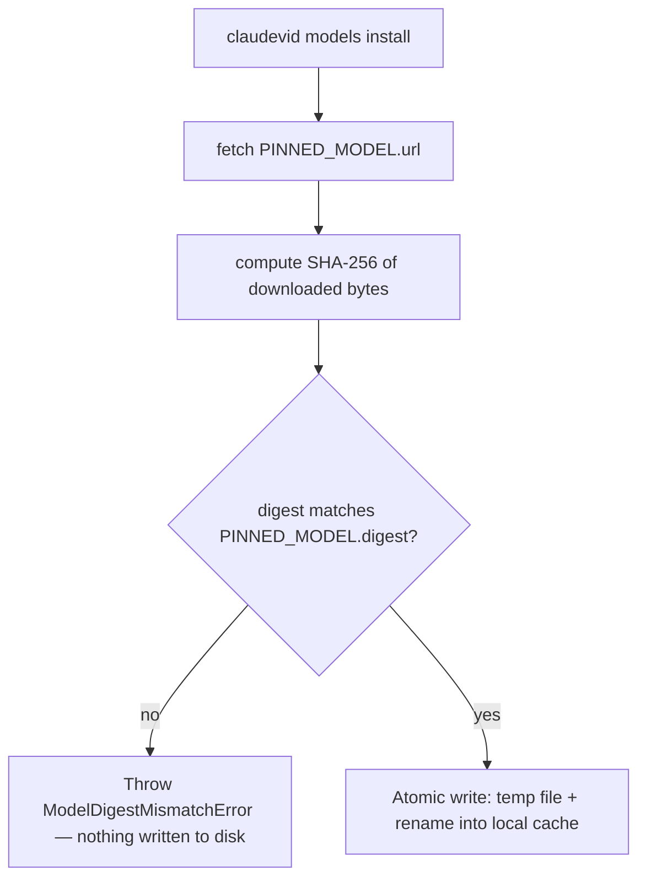

# Functional Spec: claudevid

**Path analyzed:** . (repository root)
**Date analyzed:** 2026-09-09

> claudevid has no traditional GUI — the collector's `forms[]`/`xaml_forms[]`/`other_ui_files[]` all
> came back empty, confirmed by direct inspection: this is a Node/TypeScript library whose entire
> user-facing surface is (a) the `claudevid` CLI (8 subcommands, `packages/cli/src/cli.ts:19-29`) and
> (b) the `VideoSpec` JSON schema contract itself (a human or Claude authors JSON, never fills in a
> form). Every "capability" below names the CLI command or JSON field that exposes it, per the rubric's
> instruction to treat the CLI surface and the JSON contract as this project's screens/capabilities
> equivalent.

## Capabilities

1. **Scaffold a new project — `claudevid init [--force]`.** Writes `claudevid.config.json`,
   `.claudevid/.gitignore`, and `specs/example.json` into the current directory; refuses to overwrite
   an existing config file unless `--force`. Evidence: `packages/cli/src/commands/init.ts:1-4,35-51`.

2. **Validate a VideoSpec — `claudevid validate <spec>`.** Reads and JSON-parses the file, runs
   `parseSpec`, and reports either the diagnostic list (JSON-pointer path + message + suggestion) or a
   summary line (scene count, total/auto-duration seconds, and any narration-block
   authored-vs-normalized-count mismatches). Never lets a raw `SyntaxError`/`ZodError` escape.
   Evidence: `packages/cli/src/commands/validate.ts:1-4,25-82`.

3. **Preview a spec — `claudevid preview <spec> [--watch] [--sheet <path> --frames N]`.** A single
   full-quality-pipeline preview render at ≤1280px working width (encoded with the `"preview"`
   profile), OR a static contact-sheet PNG of N evenly-spaced frames (composite flow — see **Workflow:
   Contact-Sheet Generation**), OR a `--watch` loop that re-renders on every file change (see
   **Workflow: Watch-Mode Preview**). Evidence: `packages/cli/src/commands/preview.ts:1-12,25-59`.

4. **Render a spec to a finished video — `claudevid render <spec> --out <file> [--force] [--captions]
   [--cpu-encode]`.** The full production render at the spec's native resolution, `"final"` encode
   profile. Refuses to overwrite an existing `--out` file without `--force` (DR-041). This single
   action chains a long sequence of distinct backend calls — see **Workflow: Render Pipeline**
   (Composite-Flow Rule), which this bullet cross-references rather than restating.
   Evidence: `packages/cli/src/commands/render.ts:1-4,36-120`.

5. **Generate a VideoSpec from a natural-language prompt — `claudevid generate "<prompt>" [--out]
   [--render] [--model] [--repair-attempts]`.** Requires `ANTHROPIC_API_KEY` (fails fast otherwise,
   DR-047). Chains `buildDirectorPrompt` → the bounded Claude repair loop → a final integrity
   `parseSpec` re-check → an optional full render — see **Workflow: Claude-Assisted Generation**
   (Composite-Flow Rule).
   Evidence: `packages/cli/src/commands/generate.ts:1-6,31-48,84-143`.

6. **Batch-process a directory of jobs — `claudevid batch <dir> [--concurrency N] [--render]`.**
   Classifies every `*.json` file in `<dir>` as a ready `VideoSpec`, a `{prompt, out?}` job
   description, or invalid; dispatches each through a fixed-size worker pool; writes
   `<dir>/batch-manifest.json` after every completed job (partial-progress durability, DR-043). See
   **Workflow: Batch Processing**. Evidence: `packages/cli/src/commands/batch.ts:1-7,29-44,103-227`.

7. **Install local TTS/ASR models — `claudevid models install`.** A thin wrapper over
   `@claudevid/audio`'s `installModels` — see **Workflow: Models Install** (fetch → SHA-256 verify →
   atomic write, fail-closed on mismatch, DR-024). Evidence: `packages/cli/src/commands/models.ts:1-37`.

8. **Run the render/encode benchmark — `claudevid bench`.** A thin wrapper over `@claudevid/bench`'s
   `runBench`, which renders a fixed short reference spec through the real
   `compileTimeline → renderFrame → createEncodePipe` pipeline and reports render/encode fps against
   documented time-budget targets, scaled to the reference spec's own duration.
   Evidence: `packages/cli/src/commands/bench.ts:1-37`, `tools/bench/src/bench.ts:1-35`.

9. **Author a `VideoSpec` (the JSON authoring contract itself).** This is claudevid's true "data-entry
   form" — every field is Zod-validated, and per the Field Semantics & Capture-Widget Rule each field
   below is named with its actual capture type (JSON-schema type / constraint), not a bare name list:
   - **VideoSpec**: `version` (fixed literal `"1"`), `width`/`height`/`fps` (number, each defaulted),
     `background` (free-text color string), `meta.title`/`meta.description` (free text),
     `audio.track` (free-text path string) / `audio.volume` (number, 0–1), `scenes` (array, ≥1 item).
   - **Scene**: `id` (free text, must be unique — DR-001), `duration` (number **or** the fixed literal
     `"auto"`), `background` (free text, optional), `transition.kind` (enum `cut|cross-fade`),
     `transition.duration` (number), `narration` (free text, **or** a structured
     `{text,voice,speed}` object, **or** an array of either).
   - **TextLayer**: `text` (free text/textarea-equivalent, 1–300 chars), `fontSize`/`fontWeight`
     (number, `fontWeight` range-constrained 100–900), `color`/`fontFamily` (free text), `align`
     (enum `left|center|right`).
   - **RectLayer**: `width`/`height` (number, required), `fill`/`stroke` (free-text color),
     `strokeWidth`/`radius` (number).
   - **ImageLayer**: `src` (free-text **file-path-or-URL reference**, not an upload widget — see the
     Field Semantics note on Entity 8 in `domain-model.md`), `width`/`height` (number, optional),
     `fit` (enum `cover|contain|fill`).
   - **CodeLayer**: `code` (free text/textarea-equivalent, ≤20000 chars), `lang`/`theme` (free text,
     validated against a fixed bundled list — DR-020), `width`/`height` (number, required),
     `showLineNumbers` (boolean/checkbox), `wrap` (enum `none|soft`), `reveal`/`focus`/`diff`/
     `scroll`/`annotations` (nested structured objects, each its own sub-schema).
   - **CaptionsLayer**: never authored directly — system-constructed only (DR-049); has no author-facing
     capture surface at all.
   Evidence: `packages/core/src/schema.ts`, `packages/core/src/layers.ts`, `packages/layer-code/src/schema.ts`.

## Workflows

### Render Pipeline (Composite-Flow Rule — `runRenderPipeline`)

Every render-producing command (`render`, `preview`, `generate --render`, `batch --render`) drives the
one shared pipeline in `packages/cli/src/render-pipeline.ts:333-407`. A single user action (one CLI
invocation) chains the following distinct backend calls, in order:

1. **`synthesizeNarration`** — for every scene with narration, calls `synthesize` (Kokoro TTS) once per
   narration block, with `voice` hardcoded to `block.voice ?? "af_heart"`, `speed` to
   `block.speed ?? 1`, `modelId`/`modelDigest` pinned to `PINNED_MODEL`, and **`lexiconDigest`
   hardcoded to `""`** (lexicon application is explicitly out of scope for this pipeline — see Named
   Gaps). This call is direct, **not** cache-backed (`getOrSynthesize` is bypassed on purpose, because
   the on-disk cache entry discards `sampleRate`, which this step needs).
2. **`computeAudioDurationsRecord`** — sums each `"auto"`-duration scene's synthesized block durations
   into the record `compileTimeline` consults. (This is a *different, simpler* function than
   `@claudevid/audio`'s own `computeAudioDurations` — see Named Gaps.)
3. **`compileTimeline(spec, { audioDurations })`** — produces the frame-indexed `Timeline`.
4. **`insertCaptionsLayers`** (only if `--captions` **and** the spec has any narration) — for every
   narrated scene, calls `align` (Whisper ASR) per synthesized block, offsets each `WordTiming` to
   timeline-absolute seconds, and appends a system-constructed `captions` layer.
5. **`compileTimeline`** is called a **second time** if step 4 ran, against the captions-augmented spec.
6. **`compileMotion(spec, timeline)`** — resolves every layer's `animation` into baked per-frame
   property tracks; diagnostics are printed, never fatal.
7. **`prepareCodeLayers`** (internally: `compileCodeLayers` + `layoutCode` + `checkLayoutDiagnostics`
   per code layer) — registers the `"code"` painter closure over the compiled entries.
8. **`probe()`** — detects FFmpeg presence/capabilities (`h264_videotoolbox`/`libx264`).
9. **Per-frame render loop** — `renderFrame` (canvas paint) → `pipe.write` (FFmpeg stdin), for every
   frame in `timeline.frameCount`, then `pipe.finish()`.
10. **`assembleVoiceTrack`** (only if the spec has any narration) — builds one continuous,
    silence-padded WAV spanning the whole timeline; fails closed if two narration blocks report
    different sample rates (resampling is out of scope).
11. **`buildAudioGraphArgv`** — builds a single `role: "voice"` `AudioTrack` argv (no music/SFX tracks
    are ever constructed here — Named Gap).
12. **`muxOutput`** (only if the spec has any narration) — muxes the assembled voice WAV against the
    silent video into the final `--out`/`--sheet` path, honoring `--force` (DR-035) and the
    duration-tolerance check (DR-034).

**What is functionally lost if a step is omitted:**
- Skip step 6 (`compileMotion`): no layer ever animates, regardless of any `animation` field authored
  in the spec.
- Skip step 7 (`prepareCodeLayers`): no `"code"` painter is ever registered for this render, so every
  `code` layer paints nothing (silent, not an error).
- Skip step 10–12 (voice track + mux): the output file is exactly the silent video written by step 9 —
  every scene's authored `narration` is synthesized (step 1, real TTS cost paid) but never actually
  heard in the final file.
- Skip step 4 (captions) when `--captions` was requested but the spec has zero narration: this is the
  pipeline's own documented behavior (`opts.captions && hasNarration`), not a bug — silently no
  captions layer is added.

### Claude-Assisted Generation (Composite-Flow Rule — `generateSpec` + `runGenerate`)

A single `claudevid generate` invocation chains:

1. **`buildDirectorPrompt(catalogue, bundledLangs, bundledThemes, brand)`** — assembles the system
   prompt from the live motion-preset catalogue, the bundled code langs/themes, and the project's
   brand kit (hard-forbidding a `captions` layer, DR-049).
2. **`generateSpec`** — itself a bounded repair loop (branches, see flowchart below): calls
   `createStructuredMessage` (one real Anthropic tool-call), then `parseSpec`s the result; on failure,
   appends the model's own bad output plus a repair instruction naming the exact diagnostics, and
   retries, up to `repairAttempts` (default 3) total attempts.
3. **`writeFile(outPath, ...)`** — writes the resulting spec to disk (default
   `specs/<slugified-prompt>.json`).
4. **`parseSpec`** (a *second*, final integrity check) — "should never fail given `generateSpec`'s own
   contract, but checked rather than assumed."
5. **Optional — `--render`**: runs the full **Render Pipeline** workflow above against the freshly
   written spec, with a `final` profile; a render failure is reported distinctly from a successful
   generate (the generate's own success is never overwritten by a later render failure).

**What is functionally lost if a step is omitted:** skipping step 4 would let a
theoretically-malformed `generateSpec` result reach disk undetected; skipping step 2's repair retries
(calling the API only once) would surface every transient/near-miss model output as an outright
failure instead of a self-corrected one.

### Batch Processing (`runBatch`)

A single `claudevid batch <dir>` invocation: lists every `*.json` file (excluding
`batch-manifest.json`) → classifies each file's content as a ready `VideoSpec`, a `{prompt, out?}`
job description, or invalid (neither) → runs every classified-valid job through a fixed-size worker
pool (`--concurrency`, default 1) pulling from a shared index → a `prompt` job delegates to the
**Claude-Assisted Generation** workflow; a ready-`spec` job runs the **Render Pipeline** workflow
directly, only if `--render` → after **every** completed job (success or failure), rewrites
`batch-manifest.json` in original file order, so a killed batch still leaves a usable partial
manifest. Individual job failures are recorded but never fail the batch itself (DR-043; the process
exit code is always 0 once the batch has run). Fully traced from `packages/cli/src/commands/batch.ts:29-227`.

### Contact-Sheet Generation (`renderContactSheet`, Composite-Flow Rule)

`claudevid preview <spec> --sheet <path> [--frames N]`: `compileTimeline(spec)` (called with **no**
`audioDurations` — an `"auto"`-duration scene throws `MissingAudioDurationError`, left to propagate;
see Named Gaps) → for each of `N` (1–24, default 6, DR-044) evenly-spaced frame indices, calls
`renderFrame` once and composites the result into a grid `Canvas` → the assembled grid is PNG-encoded
and written to `--sheet`. Fully linear (no branch beyond the upstream `MissingAudioDurationError`
propagation), so no flowchart is required. Evidence: `packages/cli/src/commands/preview.ts:89-134`.

### Watch-Mode Preview (`watchPreview`)

`claudevid preview <spec> --watch`: runs one preview render immediately, then installs an
`fs.watch(specPath)` listener debounced 250ms; on every change it re-reads, re-`JSON.parse`s,
re-`parseSpec`s, and re-runs the preview render — a bad spec or a failed render logs an error and
waits for the next change rather than crashing the loop. Runs until the process is killed. Evidence:
`packages/cli/src/commands/preview.ts:136-177`.

### Models Install (`installModels`, branches on digest mismatch)

`claudevid models install`: `fetch(PINNED_MODEL.url)` → compute the downloaded bytes' SHA-256 digest →
compare against `PINNED_MODEL.digest` → on mismatch, throw `ModelDigestMismatchError` **before writing
anything to disk** (fail-closed, DR-024); on match, write atomically (temp file + rename) into the
local models cache. Evidence: `packages/audio/src/models.ts:90-133`, `packages/cli/src/commands/models.ts:1-37`.

## UI Inventory

> No `.dfm`/`.xaml`/other-UI-shaped files exist in this codebase (collector confirmed
> `forms:[]`, `xaml_forms:[]`, `other_ui_files:[]`; verified directly — `top_level_dirs` contains no
> GUI framework directory). The inventory below is therefore this project's actual user-facing
> surface: 8 CLI commands, each fully parsed (source read directly, not detection-only), plus the
> JSON-schema-driven layer types that stand in for "data-entry forms."

| # | Surface | Kind | Parsed? | Control/handler count | Notes |
|---|---------|------|---------|------------------------|-------|
| 1 | `claudevid init` | CLI command | Fully parsed | 1 flag (`--force`, boolean/checkbox-equivalent) | No non-text input controls. |
| 2 | `claudevid validate <spec>` | CLI command | Fully parsed | 1 positional arg | No non-text input controls. |
| 3 | `claudevid preview <spec>` | CLI command | Fully parsed | 4 flags: `--watch` (boolean), `--sheet <path>` (text), `--frames N` (numeric, range-checked 1–24) | Numeric range control (`--frames`). |
| 4 | `claudevid render <spec> --out <file>` | CLI command | Fully parsed | 4 flags: `--out` (text, required), `--force`/`--captions`/`--cpu-encode` (booleans) | No non-text input controls beyond booleans. |
| 5 | `claudevid generate "<prompt>"` | CLI command | Fully parsed | 4 flags: `--out` (text), `--model` (text), `--render` (boolean), `--repair-attempts` (numeric, positive-integer-checked) | Numeric control (`--repair-attempts`). |
| 6 | `claudevid batch <dir>` | CLI command | Fully parsed | 2 flags: `--concurrency N` (numeric, positive-integer-checked), `--render` (boolean) | Numeric control (`--concurrency`). |
| 7 | `claudevid models install` | CLI command | Fully parsed | 0 flags (argv ignored) | No controls. |
| 8 | `claudevid bench` | CLI command | Fully parsed | argv forwarded verbatim to `@claudevid/bench` | Not further parsed in this pass — `tools/bench/src/args.ts` owns its own flags, out of this run's read depth (Named Gap). |
| 9 | `VideoSpec` JSON schema (root authoring contract) | Schema-driven "form" equivalent | Fully parsed (Zod schema read directly) | ~10 top-level fields, 6 layer-type sub-schemas | Non-text-equivalent controls: `version` (fixed-literal selector), `scenes[].duration` (number **or** fixed-literal `"auto"` — a discriminated toggle), `transition.kind` (enum select), all layer `type` discriminators (enum select), `TextLayer.align`/`ImageLayer.fit`/`CodeLayer.wrap` (enum selects), `ImageLayer.src` (**file/asset-reference field** — see Field Semantics note), `CodeLayer.showLineNumbers` (boolean/checkbox), numeric range fields (`fontWeight` 100–900, `fontSize` floors, etc). |
| 10 | `CaptionsLayer` schema | Schema-driven, system-only | Fully parsed | 0 author-facing fields | Never authored by a human or Claude (DR-049) — present in the schema union solely for the render pipeline's own internal construction. |

## Named Gaps

1. **`PINNED_MODEL.digest` is a placeholder, not a real SHA-256.** The source itself flags this with a
   `TODO`: "The value below is a syntactically-valid placeholder only; it does not correspond to any
   real file and installing against it will (correctly) fail closed until replaced."
   `claudevid models install` will therefore always throw `ModelDigestMismatchError` against the real
   pinned URL as currently committed. Evidence: `packages/audio/src/models.ts:44-54`.

2. **The pronunciation lexicon (`@claudevid/audio/lexicon.ts`) is fully implemented and tested, but
   never actually wired into any CLI-driven render.** `render-pipeline.ts`'s `synthesizeNarration`
   hardcodes `lexiconDigest: ""` for every request and never calls `applyLexicon`/
   `resolveLexiconDigest`; no other CLI code path constructs a `SynthesisRequest` with a non-empty
   lexicon digest either. A project's configured lexicon (if one were authored) would silently have
   zero effect on any `claudevid render`/`preview`/`generate --render` output.
   Evidence: `packages/cli/src/render-pipeline.ts:98-105`; grep confirms `applyLexicon`/
   `resolveLexiconDigest` are called only from `packages/audio`'s own test suite.

3. **`@claudevid/audio`'s own `computeAudioDurations` (with its cache-backed synthesis, padding, and
   `EmptyNarrationError`/`MaxDurationExceededError`/floor-to-minimum guards, DR-026/027/028) is never
   called from `packages/cli` at all.** The CLI's shared render pipeline has its own, simpler,
   parallel `computeAudioDurationsRecord` (`packages/cli/src/render-pipeline.ts:120-131`) that sums
   synthesized durations with **no** padding, **no** maximum-duration ceiling, and **no**
   `EmptyNarrationError` for an empty-narration `"auto"` scene (it silently computes `0` instead, via
   `.reduce(..., 0)` over an empty array). This means three tested, well-evidenced business rules in
   `@claudevid/audio` are **unreachable** from the actual `claudevid render`/`preview`/
   `generate --render` commands a user runs.

4. **`checkThemeContrast` (WCAG contrast audit, `@claudevid/layer-code/themes.ts`) is exported and unit
   tested, but not invoked anywhere in the compile-time diagnostics path (`highlight.ts`'s
   `compileCodeLayers`) or the render path.** A caller (a future director-prompt catalogue, per its
   own doc comment) must invoke it explicitly; no code in scope does. Confirmed via
   `grep -rln checkThemeContrast` — only `themes.ts` itself, its test, and `index.ts`'s re-export.

5. **The audio-graph's `AudioTrack.role: "music"|"sfx"` and `duck`/`loop` fields have no authoring
   surface anywhere in `VideoSpec`/`Scene`/`NarrationBlock`.** `render-pipeline.ts`'s
   `assembleVoiceTrack`/mux step only ever constructs a single `role: "voice"` track
   (`packages/cli/src/render-pipeline.ts:399`) — music-bed and SFX mixing/ducking is a fully built,
   tested capability of `@claudevid/audio`'s `buildAudioGraphArgv` with no way for a spec author to
   reach it through the shipped CLI.

6. **Contact-sheet preview (`--sheet`) cannot render any spec containing an `"auto"`-duration scene.**
   `renderContactSheet` calls `compileTimeline(spec)` with no `audioDurations`, so
   `MissingAudioDurationError` propagates uncaught — the source's own comment states this is "out of
   scope for v1," not an oversight, but it remains a real capability gap for narrated auto-duration
   specs. Evidence: `packages/cli/src/commands/preview.ts:83-87`.

7. **`animation.exit` is schema-legal (any layer may set it) but has no working implementation** — it
   is always diagnosed as "not supported yet — deferred to a follow-up change" at compile time,
   regardless of value. A capability the JSON schema exposes with zero actual effect.
   Evidence: `packages/motion/src/compile.ts:121-127`.

8. **`claudevid bench`'s own argv (`tools/bench/src/args.ts`) was not opened in this pass** — the CLI
   command forwards `argv` verbatim to `@claudevid/bench`'s `runBench`, whose own flag parsing is out
   of this run's read depth. Its handler count in the UI Inventory is therefore approximate, not
   fully enumerated.

9. **Handler-to-implementation tracing for `tools/motion-preview`** (a standalone dev CLI, distinct
   from `packages/cli`) was not deeply traced — it is not imported by, or wired into, the shipped
   `claudevid` CLI at all (confirmed via `grep` across `packages/cli/src`), so it is treated as
   dev-tooling and placed under module-map.md's Unassigned section rather than force-fit into a
   user-facing capability.

10. **`CachedSynthesis`'s on-disk cache entry discards `sampleRate`** (only `durationSeconds` and
    `audioBase64` are persisted, `packages/audio/src/cache.ts`'s own `CacheEntryFile` shape) — this is
    the documented reason the shared render pipeline bypasses `getOrSynthesize` entirely
    (`render-pipeline.ts:70-85`), meaning **no CLI-driven render/preview/generate ever benefits from
    the TTS cache** — every run re-synthesizes every narration block from scratch, even if an
    identical spec was rendered moments before.
