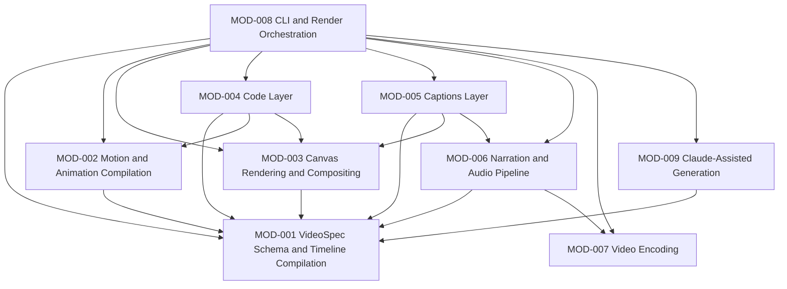

# Module Map: claudevid

**Path analyzed:** . (repository root)
**Date analyzed:** 2026-09-09
**Status:** PROPOSED — awaiting human confirmation

<!--
  module_map.present was false in the collected JSON (next_mod_id: "MOD-001", prior_modules: []) —
  there is no prior map to reconcile against. Every MOD-### below is newly assigned, in package
  order (core -> motion -> renderer-canvas -> layer-code -> layer-captions -> audio ->
  encoder-ffmpeg -> cli -> claude), which is also each module's rough dependency order.

  architecture.md is absent (architecture_md.present: false). Every "Depends on" line below is
  therefore derived from each package's own package.json `dependencies` list (collected in
  manifests[]) and/or an explicit source-code comment about what is actually imported/used — never
  a direction I could not cite. Where a package.json dependency exists but the reviewed source
  doesn't appear to use it, that discrepancy is called out explicitly (see MOD-005).
-->

## Modules

### MOD-001 — VideoSpec Schema & Timeline Compilation

- **Purpose:** Defines the `VideoSpec`/`Scene`/`Layer` JSON authoring contract, validates it (Zod),
  and compiles it into the frame-indexed `Timeline` every other module renders against. The
  zero-dependency foundation of the whole system.
- **Owns (entities):** VideoSpec, Scene, SceneTransition, NarrationBlock, Layer (base shape),
  TextLayer, RectLayer, ImageLayer, GroupLayer, Timeline, SceneWindow, TimelineLayer, Diagnostic,
  Coordinate, Animation, PropertyBag (shared neutral contract type).
- **References (not owned):** CodeLayer (MOD-004, registered into this module's runtime layer union
  via `registerLayer`, never defined here), CaptionsLayer (MOD-005, same mechanism).
- **Services/routes:** `parseSpec`, `compileTimeline`, `generateJsonSchema`, `chunkNarrationText`,
  `registerLayer`, `resolveAxis`, `resolveSceneBackground`, the named easing primitives
  (`linear`/`easeIn*`/`easeOut*`/`cubicBezier`/`steps`).
- **Screens:** None (library — no CLI command of its own; consumed by every command in MOD-008).
- **Business rules:** DR-001, DR-002, DR-003, DR-004, DR-005, DR-006, DR-007, DR-008, DR-009.
- **Depends on:** None.
- **Backlog items:** not yet backlog-linked — rebuild-backlog.md does not exist yet.
- **Evidence:**
  - `packages/core/package.json` (manifests[]) — zero `@claudevid/*` dependencies (only `zod`,
    `zod-to-json-schema`, `ajv` devDependency).
  - `packages/core/src/layers.ts:118-121` — `registerLayer`'s registry-extension mechanism, the
    exact seam MOD-004/MOD-005 use without this module depending back on them.
  - `packages/core/src/timeline.ts:136-137` — "the only timing authority in the system."

### MOD-002 — Motion & Animation Compilation

- **Purpose:** Resolves a layer's declarative `animation` field (preset name, stagger, easing,
  spring) into baked, frame-indexed property tracks the renderer applies as a transform bracket.
- **Owns (entities):** Track, ResolvedTrack, MotionResolver, Channel, CostClass, SpringSpec,
  BakedSpring, CatalogueEntry, StaggerSpec.
- **References (not owned):** VideoSpec, Timeline, TimelineLayer, Diagnostic, Animation,
  PropertyBag (all MOD-001).
- **Services/routes:** `compileMotion`, `createResolver`, `resolvePreset`/`exportCatalogue`,
  `resolveEasing`/`bakeSpring`, `orderIndices`.
- **Screens:** None.
- **Business rules:** DR-010, DR-011, DR-012, DR-013, DR-014, DR-015.
- **Depends on:** MOD-001.
- **Backlog items:** not yet backlog-linked — rebuild-backlog.md does not exist yet.
- **Evidence:**
  - `packages/motion/package.json` — `dependencies: { "@claudevid/core": "workspace:*" }` only.
  - `packages/motion/src/compile.ts:1` — imports `VideoSpec, Timeline, TimelineLayer, Diagnostic,
    Animation` from `@claudevid/core`.

### MOD-003 — Canvas Rendering & Compositing

- **Purpose:** Paints a compiled `Timeline`'s active layers for a given frame into a pixel buffer via
  `@napi-rs/canvas`, with raster caching, hold-frame reuse, and cross-fade compositing.
- **Owns (entities):** Renderer, RasterCache, FrameBuffer, RenderStats, the `PainterFn` registry
  (`registerPainter`/`getPainter`).
- **References (not owned):** Timeline, TimelineLayer, PropertyBag, TextLayer, RectLayer, ImageLayer
  (all MOD-001). `MotionResolver` (MOD-002) is consumed only as a **structurally duck-typed**
  interface — `renderer-canvas` deliberately has no real dependency on `@claudevid/motion`.
- **Services/routes:** `createRenderer`/`renderFrame`, `createFrameBuffer`/`createFrameBufferPool`,
  `registerPainter`/`getPainter`, `paintTextLayer`/`paintRectLayer`/`paintImageLayer`,
  `createRasterCache`.
- **Screens:** None.
- **Business rules:** None owned — this module's behavior (hold-frame reuse, two-pass cross-dissolve,
  raster-cache LRU eviction) is rendering-algorithm/performance behavior, not an authored-content
  business constraint; no `DR-###` was assigned here.
- **Depends on:** MOD-001.
- **Backlog items:** not yet backlog-linked — rebuild-backlog.md does not exist yet.
- **Evidence:**
  - `packages/renderer-canvas/package.json` — `dependencies: { "@claudevid/core": "workspace:*",
    "@napi-rs/canvas", "@fontsource/inter", "@fontsource/jetbrains-mono" }` — no `@claudevid/motion`.
  - `packages/renderer-canvas/src/index.ts:22-28` — "this package does not depend on
    `@claudevid/motion` (spec.md FR13/FR15: neither package gains a new dependency; `PropertyBag` is
    the shared neutral type both already get from `@claudevid/core`)."

### MOD-004 — Code Layer

- **Purpose:** The `code`-typed layer: syntax highlighting (Shiki), legibility auto-fit/overflow
  guardrails, and reveal/focus/diff/scroll/annotation animation behavior for an in-video code
  window.
- **Owns (entities):** CodeLayer, CodeReveal, CodeFocus, CodeDiff, CodeScroll, CodeAnnotation,
  LayoutResult, LayoutLine, TokenizedCode, Token, CompiledCodeLayer, LineCache, ChromeCache.
- **References (not owned):** Timeline, TimelineLayer, Diagnostic, VideoSpec (MOD-001); `Channel`,
  `orderIndices`, `resolveEasing` (MOD-002, real dependency); the `PainterFn` registry (MOD-003, real
  dependency, via `registerPainter("code", paintCodeLayer)`).
- **Services/routes:** `compileCodeLayers`, `layoutCode`, `checkLayoutDiagnostics`,
  `paintCodeLayer`/`renderCodeFrame`, `diffLines`, `annotationPosition`,
  `typewriterState`/`focusState`/`scrollOffsetPx`/`lineStaggerDelays`, `checkThemeContrast`.
- **Screens:** None (a layer type consumed via the `VideoSpec` JSON contract, MOD-008's Screens).
- **Business rules:** DR-016, DR-017, DR-018, DR-019, DR-020, DR-021, DR-050.
- **Depends on:** MOD-001, MOD-002, MOD-003.
- **Backlog items:** not yet backlog-linked — rebuild-backlog.md does not exist yet.
- **Evidence:**
  - `packages/layer-code/package.json` — `dependencies: { "@claudevid/core", "@claudevid/renderer-canvas",
    "@claudevid/motion", "@napi-rs/canvas", "zod", "shiki" }`.
  - `packages/layer-code/src/animations.ts:17` — `import { orderIndices, resolveEasing, ... } from
    "@claudevid/motion"`.
  - `packages/layer-code/src/index.ts:14` — `registerPainter` import from `@claudevid/renderer-canvas`.

### MOD-005 — Captions Layer

- **Purpose:** The `captions`-typed layer: renders forced-aligned, karaoke-style word-highlight
  captions. The one layer type never authored by a human/Claude — constructed only by MOD-008's
  render pipeline from MOD-006's forced-alignment output.
- **Owns (entities):** CaptionsLayer.
- **References (not owned):** WordTiming (MOD-006, imported as a type only); Timeline, TimelineLayer,
  Diagnostic (MOD-001); the `PainterFn` registry (MOD-003).
- **Services/routes:** `paintCaptionsLayer`, `findActiveWordIndex`, `isCaptionsLayer`.
- **Screens:** None.
- **Business rules:** DR-022.
- **Depends on:** MOD-001, MOD-003, MOD-006.
- **Backlog items:** not yet backlog-linked — rebuild-backlog.md does not exist yet.
- **Evidence:**
  - `packages/layer-captions/package.json` — `dependencies: { "@claudevid/core",
    "@claudevid/renderer-canvas", "@claudevid/motion", "@claudevid/audio", "@napi-rs/canvas", "zod" }`.
  - `packages/layer-captions/src/schema.ts:3` — `import type { WordTiming } from "@claudevid/audio"`.
  - **Discrepancy noted, not silently resolved:** the package declares a real `@claudevid/motion`
    dependency, but `packages/layer-captions/src/render.ts:9-12`'s own header comment states "This
    file therefore has no dependency on `@claudevid/motion` despite the package depending on it ...
    that dependency exists for a caller that wants to build its own captions-adjacent motion, not
    for this painter to consume." The dependency direction in package.json is cited above per the
    Module Grouping Rule's "cite the manifest" instruction; the actual reviewed source (`schema.ts`,
    `render.ts`, `index.ts`) does not exercise it.

### MOD-006 — Narration & Audio Pipeline

- **Purpose:** Text-to-speech synthesis (Kokoro), forced word-level alignment (Whisper + edit-distance
  reconciliation), a content-addressed synthesis cache, pinned/digest-verified model installation, a
  pronunciation lexicon, and the FFmpeg-backed audio-graph mixing/muxing that combines narration with
  a silent video.
- **Owns (entities):** SynthesisRequest, CachedSynthesis, PinnedModel, LexiconEntry/Lexicon,
  WordTiming, AlignRequest, AlignResult, AudioTrack (audio-graph), AudioDurationsOptions.
- **References (not owned):** VideoSpec, Scene, NarrationBlock (MOD-001); EncoderCapabilities (MOD-007,
  via `graph.ts`'s `resolveFfmpegCapabilities` thin wrapper over `probe()`).
- **Services/routes:** `synthesize`, `align`, `getOrSynthesize`/`hashSynthesisRequest`,
  `installModels`/`verifyInstalledModel`, `applyLexicon`/`resolveLexiconDigest`,
  `computeAudioDurations`, `buildAudioGraphArgv`, `muxOutput`, `probeDurationSeconds`.
- **Screens:** None (invoked by MOD-008's `models install` command and its shared render pipeline).
- **Business rules:** DR-023, DR-024, DR-025, DR-026, DR-027, DR-028, DR-029, DR-030, DR-031, DR-032,
  DR-033, DR-034, DR-035, DR-036.
- **Depends on:** MOD-001, MOD-007.
- **Backlog items:** not yet backlog-linked — rebuild-backlog.md does not exist yet.
- **Evidence:**
  - `packages/audio/package.json` — `dependencies: { "@claudevid/core", "@claudevid/encoder-ffmpeg",
    "@huggingface/transformers", "kokoro-js", "onnxruntime-node" }`.
  - `packages/audio/src/graph.ts:16` — `import { probe, type EncoderCapabilities } from
    "@claudevid/encoder-ffmpeg"`.
  - **Named Gap cross-reference (functional-spec.md #3):** this module's own `computeAudioDurations`
    (DR-026/027/028's owner) is never called from MOD-008 — a real cross-module wiring gap, recorded
    there rather than silently assumed fixed here.

### MOD-007 — Video Encoding

- **Purpose:** FFmpeg process lifecycle: capability probing, codec/bitrate resolution, argv
  construction, frame-streaming with real backpressure, progress parsing, and temp-directory/
  process-hygiene cleanup. Deliberately has zero knowledge of `VideoSpec`/rendering.
- **Owns (entities):** EncoderCapabilities, ResolvedProfile, ProgressEvent, ArgvInput, FrameGeometry,
  TempRun, EncodePipe.
- **References (not owned):** None.
- **Services/routes:** `probe`, `resolveProfile`, `buildArgv`, `createEncodePipe`, `createTempRun`.
- **Screens:** None.
- **Business rules:** DR-037, DR-038, DR-039, DR-040.
- **Depends on:** None.
- **Backlog items:** not yet backlog-linked — rebuild-backlog.md does not exist yet.
- **Evidence:**
  - `packages/encoder-ffmpeg/package.json` — zero `@claudevid/*` dependencies.
  - `packages/encoder-ffmpeg/src/types.ts:1-4` — "This package has no `@claudevid/*` dependency and
    no dependency on the render stack (NFR3)."

### MOD-008 — CLI & Render Orchestration

- **Purpose:** The `claudevid` command-line entry point and the single shared render pipeline every
  render-producing command drives. The integration point for every other module — owns no domain
  entity of its own beyond CLI-local plumbing shapes.
- **Owns (entities):** CliConfig, RenderPipelineOptions, BatchJobResult, GenerateCommandArgs/Result
  (CLI-local shapes; `CliConfig` is a structurally-duplicated, non-Zod mirror of MOD-009's
  `BrandKitConfig` — `packages/cli/src/config.ts:4-6` states this explicitly).
- **References (not owned):** VideoSpec/Timeline/Diagnostic (MOD-001); MotionResolver/compileMotion
  (MOD-002); Renderer/FrameBuffer (MOD-003); CompiledCodeLayer/compileCodeLayers (MOD-004); the
  captions layer registration side-effect import (MOD-005); SynthesisRequest/synthesize/align/
  AudioTrack/muxOutput/PINNED_MODEL (MOD-006); EncoderCapabilities/probe/createEncodePipe/
  createTempRun (MOD-007); generateSpec/buildDirectorPrompt/BrandKitConfig (MOD-009); `@claudevid/bench`
  (dev-tooling, folded into this module's `bench` command rather than its own module — see Unassigned).
- **Services/routes:** `runRenderPipeline` (the orchestrator); the 8 command handlers (`init`,
  `validate`, `preview`, `render`, `generate`, `batch`, `models install`, `bench`).
- **Screens:** `claudevid init`, `claudevid validate`, `claudevid preview`, `claudevid render`,
  `claudevid generate`, `claudevid batch`, `claudevid models install`, `claudevid bench` (functional-spec.md's UI Inventory).
- **Business rules:** DR-041, DR-042, DR-043, DR-044, DR-045.
- **Depends on:** MOD-001, MOD-002, MOD-003, MOD-004, MOD-005, MOD-006, MOD-007, MOD-009.
- **Backlog items:** not yet backlog-linked — rebuild-backlog.md does not exist yet.
- **Evidence:**
  - `packages/cli/package.json` — `dependencies` lists all of `@claudevid/claude`, `@claudevid/core`,
    `@claudevid/motion`, `@claudevid/renderer-canvas`, `@claudevid/encoder-ffmpeg`, `@claudevid/audio`,
    `@claudevid/layer-code`, `@claudevid/layer-captions`, `@claudevid/bench`.
  - `packages/cli/src/render-pipeline.ts:13-38` — imports concrete symbols from every one of MOD-001
    through MOD-004 and MOD-006/MOD-007 in one file, confirming it is the true integration point.

### MOD-009 — Claude-Assisted Generation

- **Purpose:** Builds the director system prompt, drives the bounded Claude structured-output repair
  loop to produce a valid `VideoSpec`, and supports multi-chapter outline/merge for long-form videos.
- **Owns (entities):** BrandKitConfig, StyleContract, ChapterOutline, GenerateResult, ClientMessage.
- **References (not owned):** VideoSpec (MOD-001, via `generateJsonSchema`/`parseSpec`);
  CatalogueEntry (MOD-002, via `exportCatalogue`, consumed only as a parameter type — this module
  itself has no `@claudevid/motion` dependency; the catalogue is passed in by MOD-008's `generate`/
  `batch` commands).
- **Services/routes:** `generateSpec`, `buildDirectorPrompt`, `outline`/`mergeChapters`,
  `createStructuredMessage`.
- **Screens:** None (invoked by MOD-008's `generate`/`batch` commands).
- **Business rules:** DR-046, DR-047, DR-048, DR-049.
- **Depends on:** MOD-001.
- **Backlog items:** not yet backlog-linked — rebuild-backlog.md does not exist yet.
- **Evidence:**
  - `packages/claude/package.json` — `dependencies: { "@claudevid/core", "@claudevid/motion",
    "@claudevid/layer-code", "@anthropic-ai/sdk", "zod" }`.
  - `packages/claude/src/generate.ts:1-2` — `import { generateJsonSchema, parseSpec } from
    "@claudevid/core"`. `CatalogueEntry` itself is only referenced as a type in
    `packages/claude/src/types.ts:2,7` — no `exportCatalogue` call lives inside `packages/claude/src`
    (MOD-008's `generate.ts`/`batch.ts` call it and pass the result in), so DR-047's Evidence line
    above states the dependency as declared-and-typed, not as an internally-invoked one.

## Cross-Module References

| Entity / capability | Owning module | Referenced by |
|---|---|---|
| VideoSpec, Scene, NarrationBlock, Timeline, TimelineLayer, Diagnostic, Animation, PropertyBag, Coordinate | MOD-001 | MOD-002, MOD-003, MOD-004, MOD-005, MOD-006, MOD-008, MOD-009 |
| CodeLayer (registered into MOD-001's runtime layer union) | MOD-004 | MOD-001 (registry only, not a type reference), MOD-008 |
| CaptionsLayer (registered into MOD-001's runtime layer union) | MOD-005 | MOD-001 (registry only), MOD-008 |
| Channel, orderIndices, resolveEasing, CatalogueEntry, MotionResolver | MOD-002 | MOD-003 (duck-typed, no real dependency), MOD-004 (real dependency), MOD-008, MOD-009 (CatalogueEntry only) |
| Renderer, PainterFn registry | MOD-003 | MOD-004, MOD-005, MOD-008 |
| CompiledCodeLayer, compileCodeLayers | MOD-004 | MOD-008 |
| WordTiming, SynthesisRequest, synthesize, align, AudioTrack, muxOutput, PINNED_MODEL | MOD-006 | MOD-005 (WordTiming type only), MOD-008 |
| EncoderCapabilities, probe, createEncodePipe, createTempRun | MOD-007 | MOD-006 (via `resolveFfmpegCapabilities`), MOD-008 |
| BrandKitConfig, generateSpec, buildDirectorPrompt | MOD-009 | MOD-008 |

## Module Dependencies

**Narrative.** MOD-001 (VideoSpec Schema & Timeline Compilation) and MOD-007 (Video Encoding) are the
two dependency-free foundations — MOD-001 by design (the JSON contract everything else builds on)
and MOD-007 by design (explicitly documented as having "no dependency on the render stack"). MOD-008
(CLI & Render Orchestration) is the single integration point depending on every other module — it is
the only module with no reverse dependents, matching its role as the outermost, user-facing layer.
Every "Depends on" arrow above is cited to a `package.json` `dependencies` entry (collected in
`manifests[]`) and/or an explicit import statement I opened this run; none is inferred from directory
layout alone.

## Unassigned

- **`tools/motion-preview`** (a standalone dev CLI: `packages/../tools/motion-preview/src/{args,cli,
  render-preview}.ts`) — not imported by, or wired into, the shipped `claudevid` CLI (`packages/cli`)
  at all; confirmed via `grep -rl motion-preview packages/cli/src` returning no matches. It depends on
  MOD-001/MOD-002/MOD-003 (`@claudevid/core`, `@claudevid/motion`, `@claudevid/renderer-canvas` per its
  own `package.json`) but exposes no capability a spec author or the `claudevid` binary can reach.
  Reason for exclusion: dev-tooling outside this project's shipped user-facing capability surface, not
  a migration/acceptance unit in its own right. `tools/bench` (`@claudevid/bench`), by contrast, **is**
  reachable via `claudevid bench` and is therefore folded into MOD-008 rather than left unassigned.

## Coverage Check

- **Entities (31 numbered entries in domain-model.md's Entities section):** all 31 are owned by
  exactly one module — VideoSpec, Scene, SceneTransition, NarrationBlock, Layer, TextLayer,
  RectLayer, ImageLayer, GroupLayer, Timeline, SceneWindow, TimelineLayer, Diagnostic (MOD-001, 13);
  Track/ResolvedTrack (MOD-002, 1 combined entry); CodeLayer, CodeReveal, CodeFocus, CodeDiff,
  CodeScroll, CodeAnnotation (MOD-004, 6); CaptionsLayer (MOD-005, 1); WordTiming, SynthesisRequest,
  CachedSynthesis, PinnedModel, LexiconEntry, AudioTrack (MOD-006, 6); EncoderCapabilities/
  ResolvedProfile/ProgressEvent (MOD-007, 1 combined entry); BatchJobResult (MOD-008, 1);
  ChapterOutline (MOD-009, 1). Entity #28 ("BrandKitConfig / CliConfig") is domain-model.md's one
  combined bullet for two structurally-mirrored-but-distinct config types defined in two different
  packages (`packages/claude/src/config-schema.ts` vs. `packages/cli/src/config.ts`, the latter's own
  comment states it mirrors the former) — split here as `BrandKitConfig` (MOD-009, 1) and `CliConfig`
  (MOD-008, 1), each owned by the module that actually declares it, rather than force one shared
  numbered bullet into a single module. 13+1+6+1+6+1+1+1+1+1 = 32 module-level entity assignments
  covering the 31 domain-model.md entries (entity #28 counted once on each side of its own split).
  No entity is unassigned and none is claimed by two modules for the same concrete type.
- **Business rules (DR-001 through DR-050, domain-model.md):** all 50 are owned by exactly one module
  per the per-module "Business rules" fields above (MOD-001: 9, MOD-002: 6, MOD-004: 7 including
  DR-050, MOD-005: 1, MOD-006: 14, MOD-007: 4, MOD-008: 5, MOD-009: 4 — 9+6+7+1+14+4+5+4 = 50). None
  is unassigned.
- **Screens (8 CLI commands, functional-spec.md UI Inventory):** all 8 are owned by MOD-008. The
  `VideoSpec` JSON schema "form"-equivalent and the `CaptionsLayer` schema (inventory rows 9-10) are
  not modules' "Screens" in the CLI sense — they are covered as entities under MOD-001/MOD-004/MOD-005
  respectively, per this document's Entities fields.
- **Nothing else to report:** every finding in domain-model.md and functional-spec.md traces to
  exactly one module above, or to the Unassigned section's single dev-tooling exclusion.
