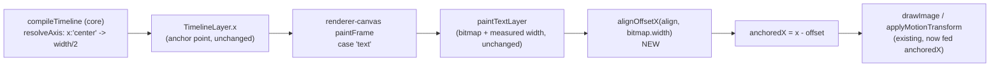

# Design: Text layer centering respects `align`

**Change:** 009-text-layer-centering
**Created:** 2026-09-08

## Technical Approach

Add a single pure helper, `alignOffsetX(align, width)`, that maps a text layer's `align` to a
horizontal offset from its resolved `x`:

```ts
function alignOffsetX(align: TextLayer["align"], width: number): number {
  if (align === "center") return width / 2;
  if (align === "right") return width;
  return 0;
}
```

In `packages/renderer-canvas/src/index.ts`'s `paintFrame`, the existing `case "text":` block
computes the bitmap via `paintTextLayer` (unchanged) and already has `bitmap.width` on hand. The
fix subtracts the offset from `layer.x` *before* handing it to either drawing path:

```ts
case "text": {
  const bitmap = paintTextLayer(cache, layer.layer, layer.layerKey);
  const anchoredX = layer.x - alignOffsetX((layer.layer as TextLayer).align, bitmap.width);
  if (bag) {
    applyMotionTransform(ctx, bag, anchoredX, layer.y, bitmap.width, bitmap.height);
    ctx.drawImage(bitmap, 0, 0);
    ctx.restore();
  } else {
    ctx.drawImage(bitmap, anchoredX, layer.y);
  }
  break;
}
```

This is the only call-site change. `applyMotionTransform` (lines 42-58) is untouched — it already
box-center-pivots at `x + boxWidth/2, y + boxHeight/2` and translates back by
`-boxWidth/2, -boxHeight/2`, so feeding it `anchoredX` instead of `layer.x` naturally moves its
pivot to the same corrected box position (FR4) — the existing "rotate/scale pivots at the box's
own center" convention (design.md 004 Key Decision D3/D4, referenced in `index.ts`'s comments) is
preserved; only *which* box position that center refers to changes, consistently between the two
drawing paths.

`rect` and `image` cases are untouched (their `RectLayer`/`ImageLayer` schemas have no `align`
field, per `packages/core/src/layers.ts`), so `alignOffsetX` is called only from the `text` case.

## Architecture

No architectural change — this stays entirely inside `@claudevid/renderer-canvas`'s existing
paint-dispatch switch. `@claudevid/core` (`resolveAxis`, `flattenLayers`) is untouched: `layer.x`
continues to mean "the anchor point `align` is relative to," which for `align: "left"` (the only
case `resolveAxis`/schema examples show today) is unchanged from "the box's left edge."



## File Changes Map

| File | Action | Description |
|------|--------|-------------|
| `packages/renderer-canvas/src/index.ts` | Modify | Add `alignOffsetX` helper; use it in the `case "text":` block to compute `anchoredX` before both the motion and plain `drawImage` paths. |
| `packages/renderer-canvas/test/render.test.ts` | Modify | Add test cases for AC1-AC5: centered/right-aligned text with numeric and `"center"` `x`, with and without a motion track. |
| `packages/renderer-canvas/src/text.ts` | Modify (doc only) | One-line comment on `paintTextLayer` or its module doc, cross-referencing `index.ts`'s `alignOffsetX` — clarifying that `align` here only governs intra-bitmap line justification, and box *placement* per `align` is `index.ts`'s job. Prevents this split ever reading as an oversight again. |

## Data Model Changes

None — no schema, type, or `VideoSpec` field changes.

## API Changes

None — no exported function signatures change. `alignOffsetX` is an internal, unexported helper
in `packages/renderer-canvas/src/index.ts`.

## Key Decisions

- **D1 — Offset applied at the call site, not inside `paintTextLayer`.** `paintTextLayer` returns
  a tightly-fit bitmap sized to the text; it has no opinion on where that bitmap lands on the
  canvas, and its cache key (content hash) must stay independent of placement so identical text
  styled identically shares one cached bitmap regardless of where different layers place it
  (`text.ts`'s existing "two layers with identical text/font/color should share one cached
  bitmap" contract, FR4 of the raster-cache change). Computing the anchor offset in `index.ts`,
  where `layer.x`/`layer.y` already live, keeps that separation intact.
- **D2 — Motion pivot moves with the corrected anchor (resolves proposal's first open
  question).** Feeding `applyMotionTransform` the already-anchor-corrected `x` (rather than
  leaving its pivot box-relative and only correcting the non-motion path) means a centered,
  animated text layer rotates/scales around its true visual center — the intuitive behavior, and
  the one consistent with `applyMotionTransform`'s existing box-center-pivot convention. No
  special-casing needed: it falls out of computing `anchoredX` once, before the `if (bag)` branch.
- **D3 — `y`/vertical placement is explicitly out of scope**, matching the proposal: the reported
  problem (and the downstream `bake-centering.mjs` workaround) is purely horizontal, and `align`
  has no vertical analogue in the schema today.

## Risks & Mitigations

- **Risk:** An existing spec (in this repo's own examples, or a consumer's) may rely on today's
  top-left-only placement for a layer that also sets `align: "center"`/`"right"` — the fix would
  visibly move that text.
  **Finding (checked during design, proposal's second open question):** all four bundled example
  specs (`simple-title.json`, `code-demo.json`, `tutorial.json`, `vertical-short.json`, in both
  `.claude/skills/video-generator/examples/` and `packages/claude/examples/`) use
  `x: "center"`/`align: "center"` on their title/subtitle text layers — meaning they are
  *currently rendering off-center* under the bug this change fixes. None of them are relying on
  the broken placement as intentional visual design (a title card centered text layer reading
  "Build Faster Videos with Claude" is unambiguously meant to be centered); the fix makes these
  examples render as their own authors evidently intended, not a regression. No example
  combines `align: "center"`/`"right"` with a numeric (non-`"center"`) `x` in a way that would
  produce a surprising result — every hit is the straightforward "center this on the canvas
  or box" case.
- **Risk:** A raster-cache regression — placement and caching are adjacent code paths that were
  just touched by the prior change (`1af6c54`).
  **Mitigation:** D1 keeps the cache key/bitmap generation completely untouched; only the
  `drawImage`/`applyMotionTransform` call arguments change. Existing raster-cache tests
  (`packages/renderer-canvas/test/raster-cache.test.ts`) are unaffected and serve as a regression
  check that this change doesn't touch caching behavior.
